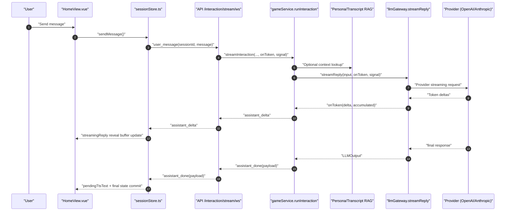
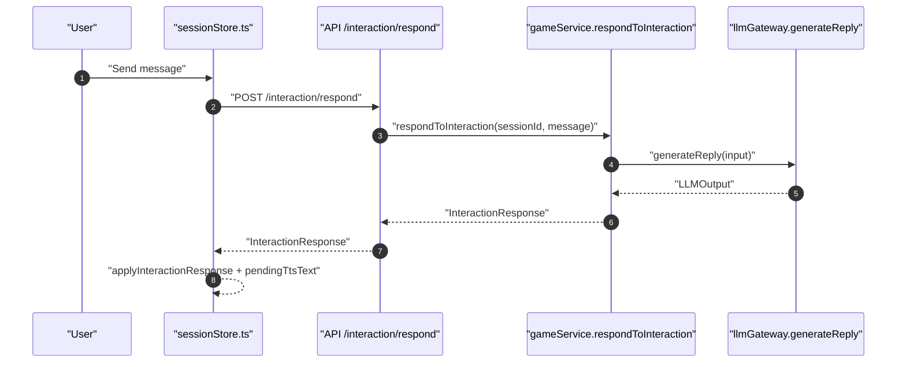
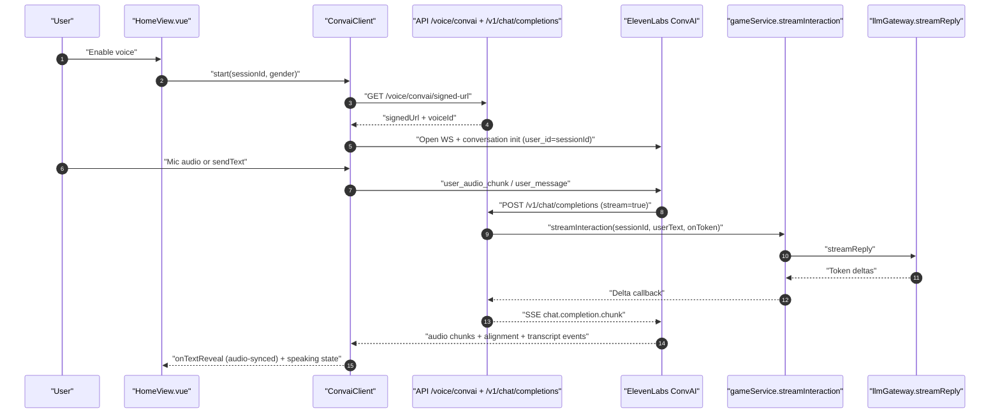

# Social Pet Chat Architecture

This document describes the current chat architecture for the Social Pet stack across:
- Web client (`apps/social-pet-web`)
- API service (`services/social-pet-api`)
- Shared domain contracts (`packages/social-pet-domain`)

It also documents the latency controls already implemented and how they affect both actual and perceived response time.

## 1. Scope and Operating Modes

The chat system currently runs in two primary modes:

1. Text chat mode (default)
- Preferred path: WebSocket streaming (`/interaction/stream/ws`)
- Fallback path: HTTP request/response (`/interaction/respond`)

2. Voice chat mode (ConvAI)
- Real-time conversational path through ElevenLabs WebSocket
- Backend proxies LLM calls via OpenAI-compatible SSE endpoint (`/v1/chat/completions`, `/chat/completions`)

## 2. Component Responsibilities

| Layer | Component | Responsibility |
|---|---|---|
| Web UI | `HomeView.vue` | Input controls, voice toggles, stop behavior, local playback UX |
| Web State | `sessionStore.ts` | Session/event state machine, WS lifecycle, HTTP fallback, reveal pacing |
| Web Voice | `convaiClient.ts` | ElevenLabs WS integration, mic streaming, audio playback queue, transcript/audio-aligned text reveal |
| API Transport | `modules/stream/routes.ts` | Bidirectional WS protocol for streaming text chat |
| API Transport | `modules/interaction/routes.ts` | Non-stream fallback interaction endpoint |
| API Transport | `modules/convai/routes.ts` | Signed URL endpoint + OpenAI-compatible SSE proxy for ElevenLabs |
| API Domain | `gameService.ts` | Core interaction pipeline: state hydration, context retrieval, LLM call, state transition, persistence |
| API Model | `llmGateway.ts` | Provider abstraction (OpenAI/Anthropic), streaming + non-streaming, timeout/abort/fallback |
| API Context | `personaRag.ts`, `transcriptRag.ts` | Optional context retrieval augmentation before model call |
| API Voice | `voiceService.ts`, `modules/voice/routes.ts` | Whisper STT + ElevenLabs TTS stream for non-ConvAI voice mode |

## 3. End-to-End Flow: Text Chat (WebSocket Primary)

## 4. End-to-End Flow: HTTP Fallback

This path is used when WS is unavailable or not ready.

## 5. End-to-End Flow: ConvAI Voice Path

## 6. Stop and Cancellation Semantics

Cancellation is wired end-to-end and is a core latency/safety control:

1. User stops output in UI.
- `HomeView.stopCurrentOutput()` calls `sessionStore.stopCurrentStream()`.

2. Store sends stop on active WS and aborts any HTTP in-flight request.
- WS: `{ type: "stop_stream" }`
- HTTP: `AbortController.abort("stopped_by_client")`

3. Stream route aborts active `gameService.streamInteraction` run.
- New incoming message also aborts previous run to prevent queue buildup/racing output.

4. Abort signal propagates into provider call in `llmGateway`.
- Provider streams stop promptly.
- Aborted runs do not persist interaction side effects.

## 7. Latency Budget and Guardrails

The system currently uses configuration and code constants as practical latency guardrails.

| Stage | Guardrail / Budget | Value | Why it matters |
|---|---|---|---|
| LLM call timeout | `LLM_TIMEOUT_MS` default | `900ms` | Caps worst-case model wait and triggers fallback quickly |
| Context window size | `LLM_HISTORY_TURNS` default | `8` turns | Limits prompt growth and token processing latency |
| Persona context cache TTL | In-memory cache | `30s` | Avoids repeated persona doc/index disk loads |
| Transcript/persona retrieval size | `TOP_K` + `MAX_CHARS` defaults | `4` + `1400 chars` | Bounds retrieval payload size |
| Voice record chunking (non-ConvAI) | `MediaRecorder.start()` interval | `250ms` | Balances responsiveness vs chunk overhead |
| ConvAI playback queue buffer | Queue lead time | `20ms` | Reduces underruns while keeping audio latency low |
| Text reveal pacing (UX) | Character delays | `35/45/100/180ms` | Maintains conversational pacing and speaking illusion |

Notes:
- Some entries are true system limits (timeout, prompt size); others are pacing controls for perceived latency.
- Runtime values can differ by environment via `.env`.

## 8. Latency Reduction Mechanisms Implemented

### 8.1 Backend (actual latency)

1. Streaming-first transport (`/interaction/stream/ws`) for incremental token delivery.
2. Provider-native streaming adapters for OpenAI and Anthropic.
3. Hard timeout with abort propagation into provider requests.
4. Fast heuristic fallback when provider call fails/times out.
5. Async persistence (`upsert`, `appendEvent`) so response path is not blocked by storage writes.
6. In-memory session cache to reduce repeated loads.
7. Bounded prompt assembly (`historyTurns`, bounded RAG payload).

### 8.2 Frontend (perceived latency)

1. Immediate local pending bubble (`pendingUserMessage`) while response is in flight.
2. Progressive reply rendering via reveal buffer (instead of waiting for full text).
3. Early TTS kickoff via `pendingTtsText` before reveal animation completes.
4. ConvAI caption reveal aligned to arriving audio chunks for lower mismatch latency.
5. Explicit stop/cancel control to avoid waiting on stale generations.

### 8.3 Voice path specifics

1. ConvAI path bypasses separate STT->text->LLM->TTS roundtrip in UI and streams live.
2. Mic audio is downsampled client-side to 16k PCM and sent continuously.
3. Audio playback is queued with a short jitter buffer, reducing choppy playback while staying responsive.

## 9. Observability and Latency Signals

Per interaction, the backend returns:
- `meta.totalLatencyMs`
- `meta.modelLatencyMs`
- `meta.usedFallback`

The web store keeps these fields in reactive state and can surface them in diagnostics/dev UI.

## 10. Known Runtime Variability (UNCONFIRMED at doc time)

These are implementation-supported but environment-dependent:
- Active model provider (`openai` or `anthropic`)
- Whether persona RAG is enabled
- Whether transcript RAG is enabled

## 11. Source Index

- `apps/social-pet-web/src/views/HomeView.vue`
- `apps/social-pet-web/src/features/pet-core/stores/sessionStore.ts`
- `apps/social-pet-web/src/features/pet-core/services/convaiClient.ts`
- `services/social-pet-api/src/app.ts`
- `services/social-pet-api/src/config/env.ts`
- `services/social-pet-api/src/modules/stream/routes.ts`
- `services/social-pet-api/src/modules/interaction/routes.ts`
- `services/social-pet-api/src/modules/convai/routes.ts`
- `services/social-pet-api/src/modules/voice/routes.ts`
- `services/social-pet-api/src/domain/gameService.ts`
- `services/social-pet-api/src/domain/llmGateway.ts`
- `services/social-pet-api/src/domain/voiceService.ts`
- `services/social-pet-api/src/persona/personaRag.ts`
- `services/social-pet-api/src/transcript/transcriptRag.ts`
